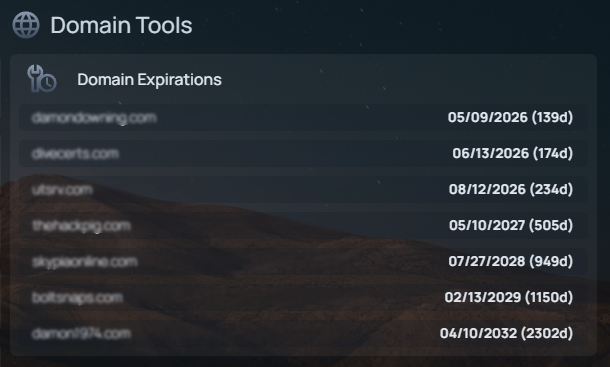

# 🌐 Domain Expiration Monitor for Homepage

A beautiful domain expiration monitoring service for [Homepage](https://gethomepage.dev/) dashboard that tracks your domain renewals and alerts you before they expire.



## ✨ Features

- 🔴 **Visual Alerts** - Red indicator when domains are approaching expiration
- 📅 **Expiration Tracking** - Shows days remaining for each domain
- 🔄 **Auto-Refresh** - Configurable cache (default 6 hours)
- 🌍 **All TLDs** - 3-tier fallback system supports 7,500+ TLDs worldwide
- 🐳 **Docker Ready** - Available as pre-built package on GHCR
- ⚡ **Fast & Lightweight** - Python FastAPI backend
- 🎨 **Homepage Native** - Uses built-in customapi widget

---

## 🚀 Installation

### Prerequisites

- Docker & Docker Compose installed
- Running [Homepage](https://gethomepage.dev/) instance
- Domains you want to monitor

---

### Method 1: Docker Compose (Recommended)

**Step 1: Create Container Directory**
```bash
mkdir -p /path/to/containers/domain-expiry
cd /path/to/containers/domain-expiry
```

**Step 2: Download compose.yml**

Download the [`compose.yml`](https://raw.githubusercontent.com/Hackpig1974/domain-expiry/main/domain-expiry/compose.yml) file:

```bash
wget https://raw.githubusercontent.com/Hackpig1974/domain-expiry/main/domain-expiry/compose.yml
# or
curl -O https://raw.githubusercontent.com/Hackpig1974/domain-expiry/main/domain-expiry/compose.yml
```

**Step 3: Pull the Docker Image**
```bash
docker compose pull
```

**Step 4: Create Configuration File**

Download the example and rename it:
```bash
wget https://raw.githubusercontent.com/Hackpig1974/domain-expiry/main/domain-expiry/.env.example -O .env
```

Or create `.env` manually:
```bash
nano .env
```

Add your configuration:
```env
DOMAINS=example.com,google.com,github.com
RDAP_BASE=https://rdap.org/domain
WHOIS_FALLBACK_ENABLED=false
WHOISXML_API_KEY=YOUR_API_KEY
ALERT_DAYS=183
REFRESH_MINUTES=360
TZ=America/Denver
```

**Step 5: Start the Container**
```bash
docker compose up -d
```

**Step 6: Verify it's Running**
```bash
# Check container status
docker ps | grep domain-expiry

# Health check
curl http://localhost:8088/healthz

# Get domain status
curl http://localhost:8088/status
```

---

### Method 2: Docker CLI (Native Command Line)

**Step 1: Create Container Directory**
```bash
mkdir -p /path/to/containers/domain-expiry
cd /path/to/containers/domain-expiry
```

**Step 2: Pull the Docker Image**
```bash
docker pull ghcr.io/hackpig1974/domain-expiry:latest
```

**Step 3: Create Configuration File**

Download the example:
```bash
wget https://raw.githubusercontent.com/Hackpig1974/domain-expiry/main/domain-expiry/.env.example -O .env
```

Edit with your settings:
```bash
nano .env
```

**Step 4: Run the Container**
```bash
docker run -d \
  --name domain-expiry \
  --env-file .env \
  -p 8088:8000 \
  --restart unless-stopped \
  ghcr.io/hackpig1974/domain-expiry:latest
```

**Step 5: Verify it's Running**
```bash
# Check container status
docker ps | grep domain-expiry

# View logs
docker logs domain-expiry

# Health check
curl http://localhost:8088/healthz

# Get domain status
curl http://localhost:8088/status
```

---

### 🔄 Updating

**Docker Compose:**
```bash
cd /path/to/containers/domain-expiry
docker compose pull
docker compose up -d
```

**Docker CLI:**
```bash
docker pull ghcr.io/hackpig1974/domain-expiry:latest
docker stop domain-expiry
docker rm domain-expiry
# Re-run the docker run command from Step 4 above
```

---

### 🐛 Troubleshooting Installation

**Container won't start:**
```bash
# Check logs
docker logs domain-expiry

# Common issues:
# - Missing required .env variables (DOMAINS, RDAP_BASE, ALERT_DAYS)
# - Port 8088 already in use (change to different port)
# - Invalid domain format in DOMAINS variable
```

**Can't access the API:**
```bash
# Verify container is running
docker ps | grep domain-expiry

# Check if port is accessible
curl http://localhost:8088/healthz

# If using a different host, replace localhost with server IP
curl http://YOUR_SERVER_IP:8088/healthz
```

**Domains showing "n/a":**
```bash
# Check logs for specific errors
docker logs domain-expiry -f

# Force refresh cache
curl "http://localhost:8088/status?force=true"

# See Configuration section for fallback options
```

---

## 📊 Configure Homepage Dashboard

Once the container is running, add it to your Homepage dashboard:

**Step 1: Edit Homepage services.yaml**

```bash
# Location depends on your Homepage setup
nano /path/to/homepage/config/services.yaml
```

**Step 2: Add Domain Expiry Widget**

```yaml
- Domain Tools:
    - Domain Expirations:
        icon: mdi-web
        widget:
          type: customapi
          url: http://YOUR_SERVER_IP:8088/status
          display: dynamic-list
          refreshInterval: 900000  # 15 minutes (in milliseconds)
          mappings:
            items: domains
            name: domain
            label: label
```

**Important:** Replace `YOUR_SERVER_IP` with:
- Docker host IP address (e.g., `192.168.1.100`) if Homepage is in a different container
- `localhost` or `127.0.0.1` if Homepage is on the same host
- Container name `domain-expiry` if on the same Docker network

**Step 3: Restart Homepage**

```bash
# If using Docker Compose
docker compose restart homepage

# If using Docker CLI
docker restart homepage
```

**Step 4: Verify Widget Appears**

The widget should now show:
- List of domains being monitored
- Expiration dates in MM/DD/YYYY format
- Days remaining in parentheses
- 🔴 Red alert emoji for domains expiring soon (within ALERT_DAYS threshold)

**Example Widget Display:**
```
Domain Expirations
├─ example.com — Exp: 🔴 01/15/2026 (23d)
├─ google.com — Exp: 09/14/2028 (997d)
└─ github.com — Exp: 10/09/2025 (291d)
```

---

### Alternative: Flat Format Widget

If you prefer a simpler list format:

```yaml
- Domain Tools:
    - Domain Expirations:
        icon: mdi-web
        widget:
          type: customapi
          url: http://YOUR_SERVER_IP:8088/flat
          display: list
          refreshInterval: 900000
          mappings:
            - field: line1
            - field: line2
            - field: line3
            # Add more lines as needed for each domain
```

This displays domains in a cleaner line-by-line format without JSON parsing.

---

## ⚙️ Configuration

### Environment Variables

| Variable | Required | Default | Description |
|----------|----------|---------|-------------|
| `DOMAINS` | ✅ Yes | - | Comma-separated list of domains to monitor |
| `RDAP_BASE` | ✅ Yes | - | RDAP server URL (use `https://rdap.org/domain`) |
| `ALERT_DAYS` | ✅ Yes | - | Show alert when days remaining ≤ this value |
| `REFRESH_MINUTES` | No | 360 | Cache duration in minutes (6 hours) |
| `ALERT_EMOJI` | No | 🔴 | Emoji to show for expiring domains |
| `TZ` | No | UTC | Timezone (e.g., `America/New_York`) |
| `WHOIS_FALLBACK_ENABLED` | No | false | Enable python-whois fallback (works for .uk/.ca/.fr/.io/.ai) |
| `WHOISXML_API_KEY` | No | - | WhoisXML API key for ALL TLDs including .bz (500 free/month) |

### 🔄 3-Tier Fallback System

The service uses intelligent fallback to maximize domain coverage:

**Tier 1: RDAP (Default)**
- ✅ Fast, free, no API key needed
- ✅ Works for most major TLDs (.com, .net, .org, .io, etc.)
- ✅ Best option for common domains

**Tier 2: python-whois (Optional)**
- ⚡ Free, no API key needed
- ⚡ Enable with `WHOIS_FALLBACK_ENABLED=true`
- ⚡ Works for: .uk, .ca, .fr, .io, .ai
- ⚡ Limited TLD support (~41%)

**Tier 3: WhoisXML API (Optional)**
- 🌍 **Works for ALL 7,500+ TLDs** including .bz, .ai, .de, .au, .nz
- 🆓 **500 free requests/month** (plenty for homelab use)
- 🔑 Requires free API key from [WhoisXML API](https://whoisxmlapi.com)
- 🎯 **Solves ccTLD problems** that RDAP doesn't support yet

**How It Works:**
1. Try RDAP (Tier 1) first
2. If RDAP fails and `WHOIS_FALLBACK_ENABLED=true`, try python-whois (Tier 2)
3. If python-whois fails and `WHOISXML_API_KEY` is set, try WhoisXML API (Tier 3)
4. If all fail: show "n/a"

**Example Configuration for Maximum Coverage:**
```bash
DOMAINS=example.com,gov.bz,mysite.uk
RDAP_BASE=https://rdap.org/domain
WHOIS_FALLBACK_ENABLED=true              # Enable Tier 2
WHOISXML_API_KEY=your-api-key-here        # Enable Tier 3
ALERT_DAYS=183
```

With this setup:
- Common domains (.com, .org) use fast RDAP
- .uk domains fall back to python-whois (fast, free)
- .bz domains fall back to WhoisXML API (works but counts against free quota)

**Get WhoisXML API Key:**
1. Sign up at https://whoisxmlapi.com (free account)
2. Get 500 free requests/month automatically
3. Copy your API key from dashboard
4. Add to `.env` file: `WHOISXML_API_KEY=your-key-here`

### Example Configurations

**High-Security Setup** (check more frequently):
```bash
DOMAINS=banking.com,payment.com
ALERT_DAYS=90
REFRESH_MINUTES=60  # 1 hour
```

**Personal Domains** (longer cache):
```bash
DOMAINS=myblog.com,portfolio.io,family.name
ALERT_DAYS=183
REFRESH_MINUTES=720  # 12 hours
```

---

## 🔧 Troubleshooting

### Widget Shows "Error" or "N/A"

1. **Check Container Logs**
   ```bash
   docker logs domain-expiry
   ```

2. **Verify API is Accessible**
   ```bash
   curl http://YOUR_IP:8088/status
   ```

3. **Test Individual Domain**
   ```bash
   curl "https://rdap.org/domain/example.com"
   ```

### Domains Not Updating

- **Force Refresh**: `curl "http://YOUR_IP:8088/status?force=true"`
- **Reduce Cache**: Lower `REFRESH_MINUTES` in `.env`
- **Restart Container**: `docker compose restart`

### "No Expiration in RDAP" Error

Some domains/TLDs don't provide expiration data via RDAP. The 3-tier fallback system can help!

**Quick Fix for ccTLDs (like .bz, .nz, .au):**

1. **Get a free WhoisXML API key:**
   - Sign up at https://whoisxmlapi.com
   - 500 free requests/month (plenty for homelab)
   - Copy your API key

2. **Add to `.env`:**
   ```bash
   WHOISXML_API_KEY=your-key-here
   ```

3. **Restart:**
   ```bash
   docker compose restart
   ```

4. **Verify logs:**
   ```bash
   docker logs domain-expiry
   # Should see: "WhoisXML API lookup successful for domain.bz"
   ```

**Alternative for some TLDs (.uk, .ca, .fr, .io, .ai):**
```bash
WHOIS_FALLBACK_ENABLED=true
```
This works without an API key but has limited TLD support.

**TLD Support Summary:**
- ✅ Most TLDs: RDAP (Tier 1, no key needed)
- ✅ .uk, .ca, .fr, .io, .ai: python-whois (Tier 2, no key needed)
- ✅ .bz, .nz, .au, .de, .jp and 7,500+ others: WhoisXML API (Tier 3, free key)

### Homepage Can't Connect

1. **Use Host IP, Not localhost**
   - ❌ `http://localhost:8088`
   - ✅ `http://192.168.1.100:8088`

2. **Check Docker Network**
   ```bash
   docker network inspect bridge
   ```

3. **Verify Port is Open**
   ```bash
   netstat -tulpn | grep 8088
   ```

---

## 💡 Tips & Best Practices

### Security

- 🔒 Don't expose port 8088 to the internet
- 🛡️ Run behind reverse proxy with auth if needed
- 📝 No sensitive data is stored
- 🔑 RDAP queries don't require authentication

### Performance

- 📊 Monitor 10-20 domains max per instance
- ⏱️ Keep cache at 6+ hours to respect RDAP servers
- 🚀 Use CDN RDAP (`rdap.org`) for best performance
- 💾 Container uses minimal resources (~50MB RAM)

### Maintenance

- 🔄 Update container regularly: `docker compose pull && docker compose up -d`
- 📅 Review alert threshold quarterly
- 🧹 Check logs occasionally: `docker logs domain-expiry --tail 100`

---

## 🤔 FAQ

**Q: Can I monitor subdomains?**  
A: No - expiration is tracked at the domain level only. Subdomains inherit the parent domain's expiration.

**Q: What about private/internal domains?**  
A: RDAP only works for publicly registered domains. Internal domains won't work.

**Q: Can I use multiple RDAP providers?**  
A: Currently no, but you could run multiple instances with different providers.

**Q: Why 6 hour cache?**  
A: Domain expiry dates change rarely. Shorter cache = unnecessary load on RDAP servers.

**Q: Can I get notifications?**  
A: Not yet - see roadmap below. For now, Homepage is your notification.

**Q: Does this work with Homepage v0.8.x?**  
A: Yes! The `customapi` widget has been available for a long time.

**Q: How many domains can I monitor?**  
A: Tested up to 50. More than that, consider multiple instances or longer cache times.

---

## 🤝 Contributing

Contributions welcome! Ideas:

1. **Report Issues** - Found a bug? Open an issue
2. **Feature Requests** - Have an idea? Start a discussion
3. **Code** - PRs welcome for features or fixes
4. **Documentation** - Improve README, add examples
5. **Testing** - Test with different TLDs and report back

---

## 📚 Related Projects

- [Homepage](https://gethomepage.dev/) - The dashboard this integrates with
- [RDAP](https://www.icann.org/rdap) - Domain registration data protocol
- [WhoisXML API](https://whoisxmlapi.com) - Universal WHOIS data provider

---

## 📄 License

GPL-3.0 License - see LICENSE file

---

## 🙏 Acknowledgments

- Homepage team for excellent dashboard & customapi widget
- RDAP.org for free RDAP meta-service
- WhoisXML API for solving ccTLD coverage
- FastAPI for the awesome Python framework

---

## 📞 Support

- 🐛 [Open an Issue](https://github.com/Hackpig1974/domain-expiry/issues)
- 💬 [Discussions](https://github.com/Hackpig1974/domain-expiry/discussions)
- ⭐ Star this repo if you find it useful!

---

Made with ❤️ for the homelab community
